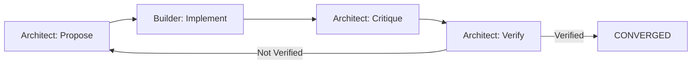

# Phase 1 — Two-Agent Loop (All Mocks)

## Objectives
Phase 1 establishes a mock two-agent orchestration loop to validate message schemas, exit logic, and basic convergence patterns before integrating real LLM agents.

## Protocol Summary
- **Message schema:** JSON Schema 2020-12 with Ajv validation
- **Loop pattern:** propose → implement → critique → verify
- **Roles:** architect (propose/critique/verify), builder (implement)

## Exit Rules
1. **CONVERGED:** Architect's verify message starts with "Verified"
2. **NO_IMPROVEMENT:** Consecutive turns produce identical diffs (stagnation)
3. **MAX_TURNS:** Loop exceeds maxTurns (default 3) without convergence

## Test Matrix
- ✅ Schema validation (valid/invalid/extra properties)
- ✅ Loop stagnation detection (turn-1 guard, identical diffs)
- ✅ Kernel convergence (default task, ≤3 turns)
- ✅ Type-check passes (tsc --noEmit)
- ✅ Smoke test (`npm run smoke:p1` exits 0)

## CI Proof
```bash
npm run check:fast  # format + lint + type-check → exit 0
npm test           # 8 tests pass
npm run smoke:p1   # prints diff + CONVERGED → exit 0
```

## Flow Diagram


## Deliverables Complete
- Schema: message.schema.json + validate.ts
- Loop: kernel.ts with 3 exits + validation wiring
- CLI: pocMock.ts (prints diff + status)
- Scripts: poc:mock, smoke:p1
- Tests: schema.spec.ts, loop.spec.ts, kernel.spec.ts
