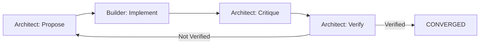

# Phase 1 — Two-Agent Loop (All Mocks)

Phase 1 is the first functional milestone in the orchestration roadmap. It stands up a fully mocked, two-agent conversation loop that exercises the message schema, exit logic, and convergence behavior without calling real LLM providers. “All Mocks” means every actor (architect, builder, bus) is implemented with deterministic fixtures; no network calls or external services participate yet.

## Objectives
Phase 1 establishes a mock two-agent orchestration loop to validate message schemas, exit logic, and basic convergence patterns before integrating real LLM agents. The goal is to prove the protocol and guardrails so later phases can swap in real providers with confidence.

## Protocol Summary
- **Message schema:** JSON Schema 2020-12 validated with Ajv (strict mode).
- **Loop cadence:** four-step cycle: propose → implement → critique → verify.
- **Role mapping:**  
  - Architect proposes the initial plan (turn 1), critiques subsequent diffs, and verifies results.  
  - Builder implements against the latest critique and produces a diff.  
- **Mocks vs real:** Architect/builder messages, diff generation, and bus are all mocked; only the protocol scaffolding is real.

## Exit Rules
1. **CONVERGED:** The architect’s verify message must begin with the literal prefix `"Verified"` (e.g., `"Verified: meets scope & checklist."`). This string contract is temporary until structured statuses arrive in a later phase.  
2. **NO_IMPROVEMENT:** If two consecutive turns produce identical diffs (`prevDiff === diff` after a builder pass), the loop exits early with stagnation. The comparison resets any time the diff changes.  
3. **MAX_TURNS:** After completing the verification step for `maxTurns` (default 3) without reaching CONVERGED, the loop terminates with reason `MAX_TURNS`.

## Test Matrix
- ✅ **Schema validation:** `schema.spec.ts` exercises valid payloads, missing keys, and unexpected properties to ensure Ajv wiring.  
- ✅ **Stagnation detection:** `loop.spec.ts` confirms turn-1 bypass and identical diff detection.  
- ✅ **Kernel convergence path:** `kernel.spec.ts` verifies the default README task converges within ≤3 turns and logs unchecked checklists on the first pass.  
- ✅ **Type-check:** `npm run type-check` (`tsc --noEmit`) guards interface alignment.  
- ✅ **Smoke:** `npm run smoke:p1` runs the CLI and expects the two-line output contract plus exit code.

## CI Proof
Each Phase 1 run should capture the following commands (all exit 0):
```bash
npm run check:fast  # Repo-wide format, lint, and type-check gates.
npm test            # Vitest suite (11 specs across schema/loop/kernel) passes.
npm run smoke:p1    # CLI prints diff on line 1, status on line 2, then exits.
```

## Flow Diagram


## Deliverables Complete
- **Schema layer:** `apps/orchestrator/src/schema/message.schema.json` + `validate.ts` define/validate Phase 1 messages.  
- **Loop engine:** `apps/orchestrator/src/kernel.ts` wires the four-step loop with all three exits and validation gates.  
- **Guard helpers:** `apps/orchestrator/src/loop/isNoImprovement.ts` encapsulates stagnation checks.  
- **CLI:** `apps/orchestrator/src/cli/pocMock.ts` exposes the smoke harness that prints diff + status.  
- **Scripts:** Workspace `poc:mock` and root `smoke:p1` enable consistent Phase 1 verification.  
- **Tests:** `schema.spec.ts`, `loop.spec.ts`, `kernel.spec.ts` cover schema, stagnation, and convergence paths.  
- **Docs:** This plan anchors the Definition of Done for the Phase 1 milestone.
